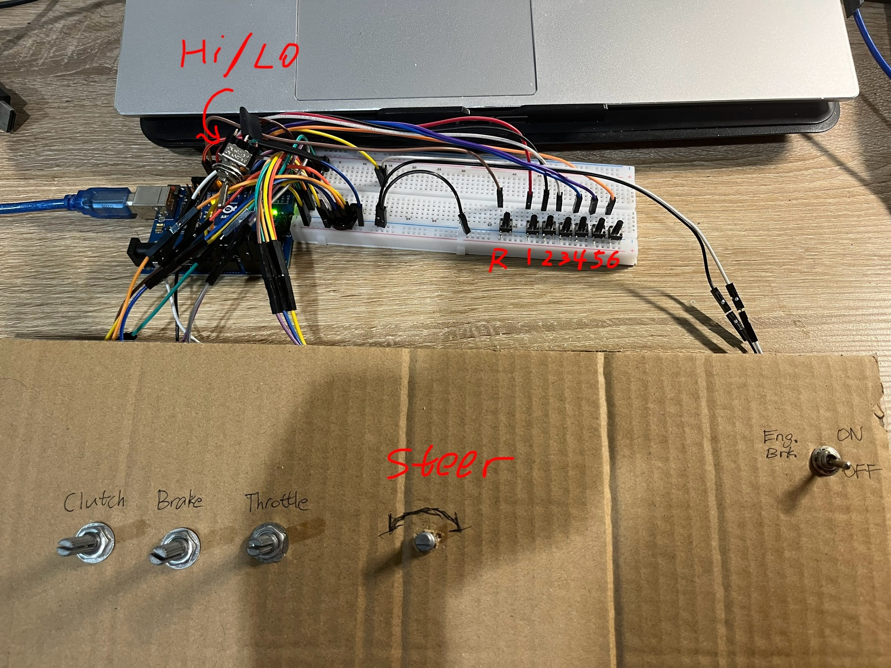
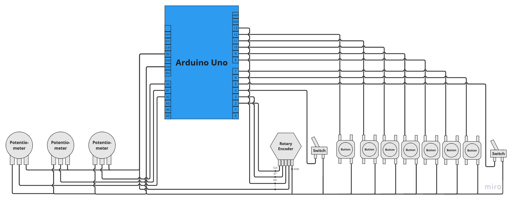

# Unojoy-Simulator-Rig
This is a simple Unojoy controller I configured to play Euro Truck Simulator 2.
## Phase 1
A simple mockup of the controller with some off-the-shelf components, including push buttons, potentiometers, rotary encoders and switches. \
\
A picture of the mockup os shown below:

The configration is as follows:
* 1 [Arduino Uno](https://surplustronics.co.nz/products/7014-arduino-uno-r3-clone-with-usb-cable).
* 1 [rotary encoder](https://surplustronics.co.nz/products/10776-rotary-encoder-module) for the steering wheel.
* 3 [potentiometers](https://surplustronics.co.nz/products/1686-10k-ohm-linear-potentiometer-) for the throttle, brake and clutch. Another one will be added later for the camera.
* 2 [toggle switches](https://surplustronics.co.nz/products/4314-switch-toggle-on-on-spdt-3-pins-panel-mount) as engine brake switch and high-low gear selector.
* 7 [tactile push buttons](https://surplustronics.co.nz/products/2159-switch-tact-push-button-momentary) for 6 forward gears and 1 reverse gear.

The wiring diagram is shown below:

Videos of the controller in action are under the `Assets` folder.

Shifting through a 12 speed with only hand controls is hard😅. So in phase 2 I will visit the near by wreckers to salvage some parts.

## Phase 2