# Unojoy-Simulator-Rig
This is a simple [Unojoy](https://github.com/AlanChatham/UnoJoy) controller I configured to play Euro Truck Simulator 2.
## Phase 1
A simple mockup of the controller with some off-the-shelf components, including push buttons, potentiometers, rotary encoders and switches. \
\
A picture of the mockup os shown below:

The configration is as follows:
* 1 [Arduino Uno](https://surplustronics.co.nz/products/7014-arduino-uno-r3-clone-with-usb-cable).
* 1 [rotary encoder](https://surplustronics.co.nz/products/10776-rotary-encoder-module) for the steering wheel.
* 3 [potentiometers](https://surplustronics.co.nz/products/1686-10k-ohm-linear-potentiometer-) for the throttle, brake and clutch. Another one will be added later for the camera.
* 2 [toggle switches](https://surplustronics.co.nz/products/4314-switch-toggle-on-on-spdt-3-pins-panel-mount) as engine brake switch and high-low gear selector.
* 7 [tactile push buttons](https://surplustronics.co.nz/products/2159-switch-tact-push-button-momentary) for 6 forward gears and 1 reverse gear.

The wiring diagram is shown below:

Videos of the controller in action are under the `Assets` folder.

Shifting through a 12 speed with only hand controls is hard😅. So in phase 2 I will visit the near by wreckers to salvage some parts.

## Phase 2
### Acquiring Parts
I took the steering wheel out of a Mazda 323 (5th gen, BF). The 3D printed parts will adapt to this particlar steering wheel.

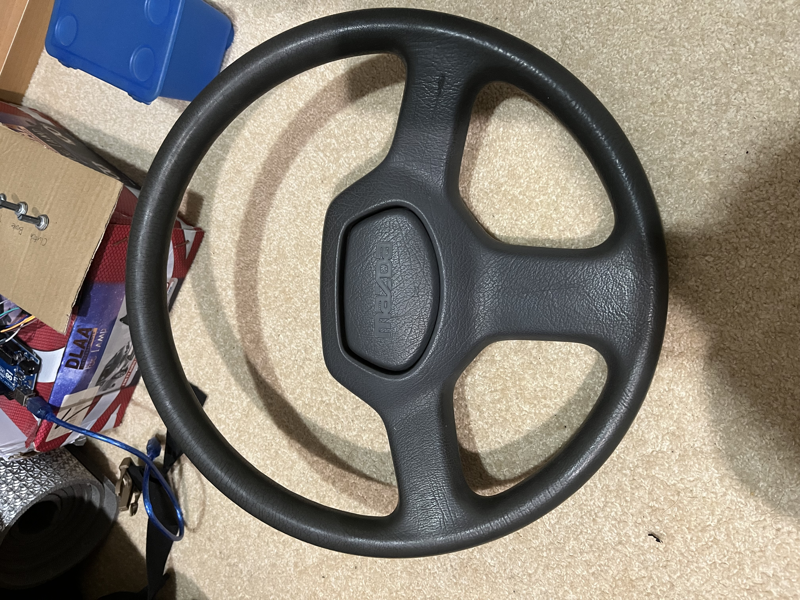

(No airbags, no problem 😎)

A picture of the car for reference (not this exact car):
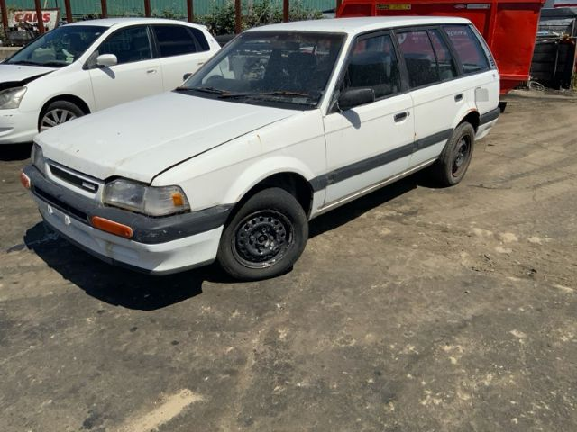

(What a lovely nugg, you will be missed 🥹. Thank you for your service 🫡)\
\
I will be constructing the rest of the simulator using 3D printed parts and off-the-shelf hardware. All CAD files are found under the `CAD` folder. CAD models are made with Autodesk Inventor.
### Steering Assembly
The steering wheel will be sandwiched between the grey and purple parts. The main steering shaft is a 32mm diameter PVC pipe. The steering wheel will be placed in between the silver and pink parts and held using a long M10 bolt for strength.

#### Front view:
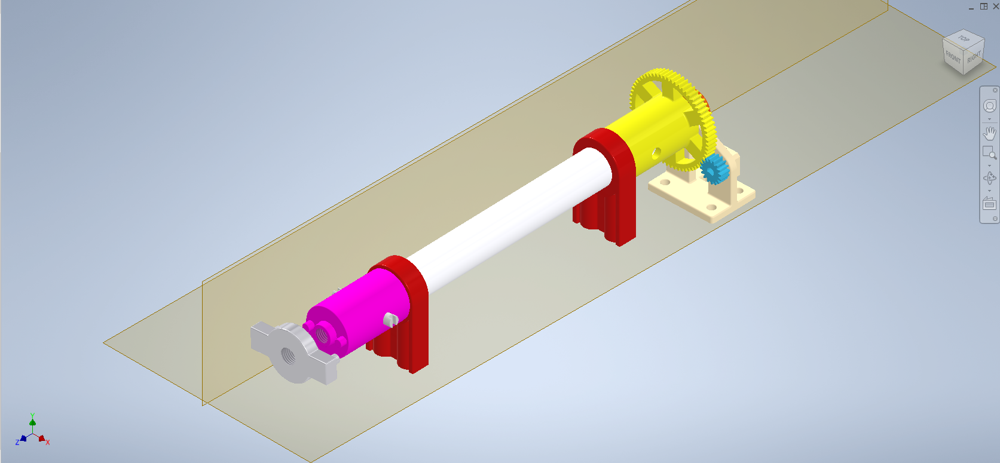

#### Rear view:
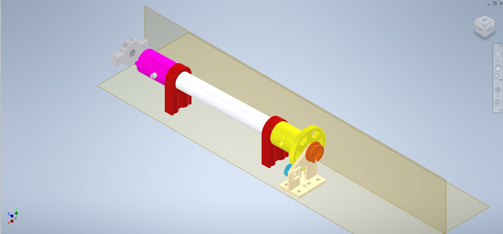

A rubber band will be attached to the orange part behind the gear and goes to the support structure. This will provide auto-centering force. A proper force feedback motor is planned for the future.\
\
The cream support structure and the two red posts will be screwed to a wooden base plate with M6 screws.\
\
The encoder is a cheaper product, thus it only has 12 pulses per revolution. To counter that, a set of gears with ratio 16:64 to slightly increase the resolution. The encoder will go into the slot on the back of the cream support. 
### Pedal Assembly
The three pedals will be revolving around the same 32mm PVC pipe. There is a hook on the green support and an ear on the grey pedals. A spring will be attached to the hook and the ear to provide resistance and resetting pedal positions. The potentiometers will be attached using a rope drive as shown in this [video](https://www.youtube.com/watch?v=5Pex7cJlhsA&list=WL&index=2&t=226s).

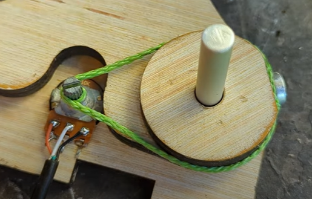

#### Front view:
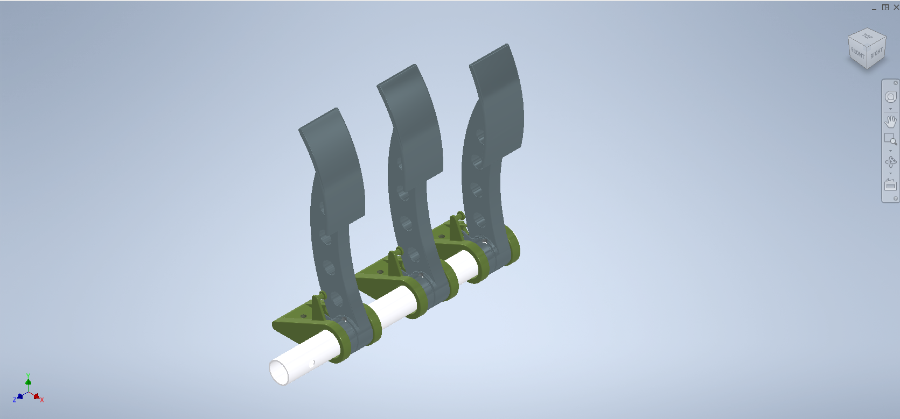

#### Rear view:
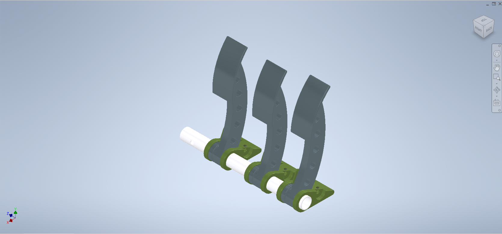

#### Pedal movement:
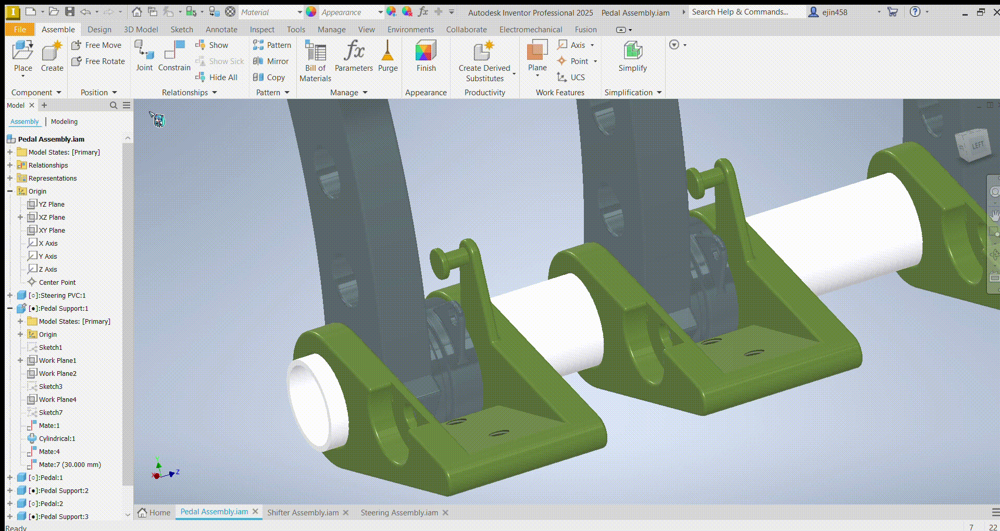

Egonomics will be tested on these pedals to ensure comfort and ease of heel-and-toe shifting. The shape and size of the pedals may subject to change. (Or I might get some real pedals from a car, who knows?)
### Shifter Assembly
The shifter is a standard 6-speed H-pattern shifter with reverse next to 1st gear. The supporting columns and the actual shift rod are 15mm PVC pipes. One of the column needs to be removed to leave space for the reverse. However, considering they have very little load on them, this will not affect the stability of the shifter. 

#### Front view:
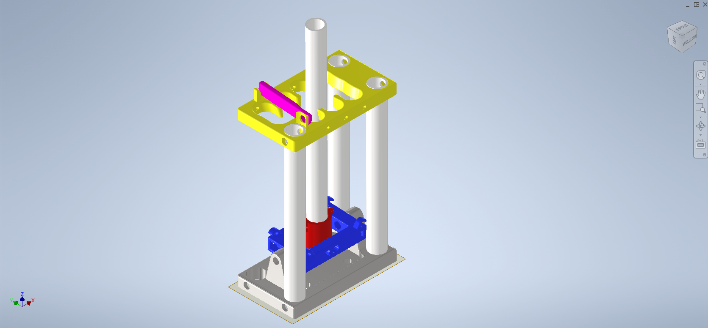

#### Rear view:
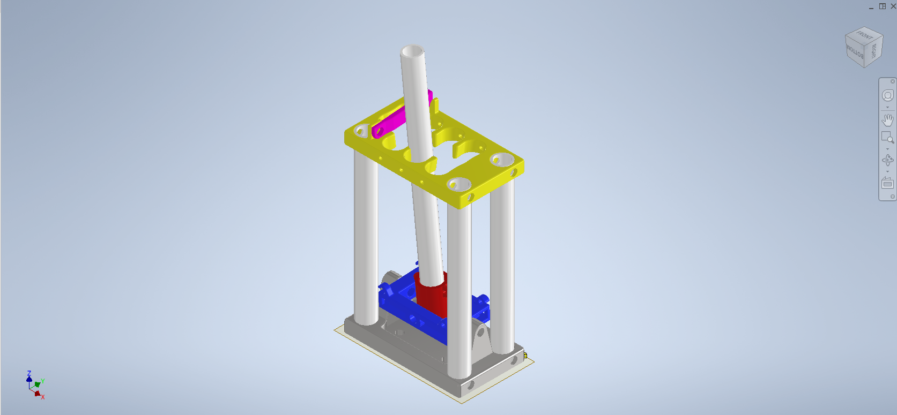

The purple piece is the reverse lockout, which can be flipped up for the shifter to move into reverse. This is inspired by the shifter in the [Ferrari 312 T2](https://www.youtube.com/watch?v=Ag03SegGTds). Jkjk 😁

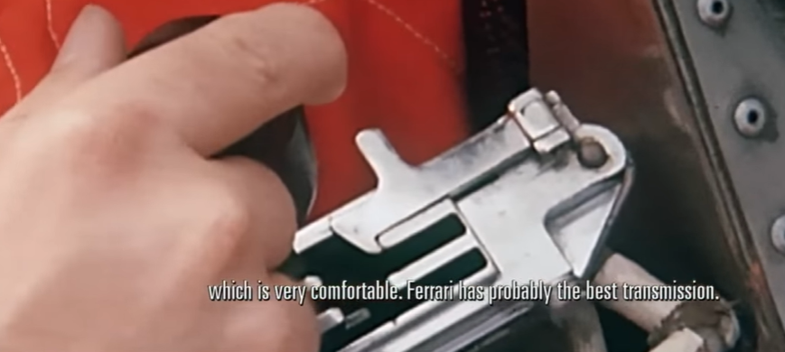

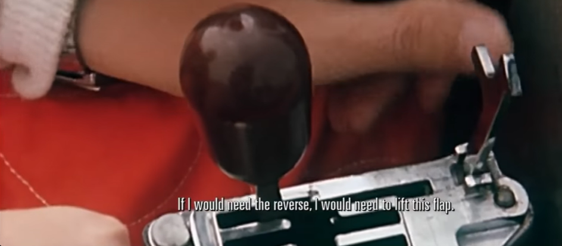

#### Top view:
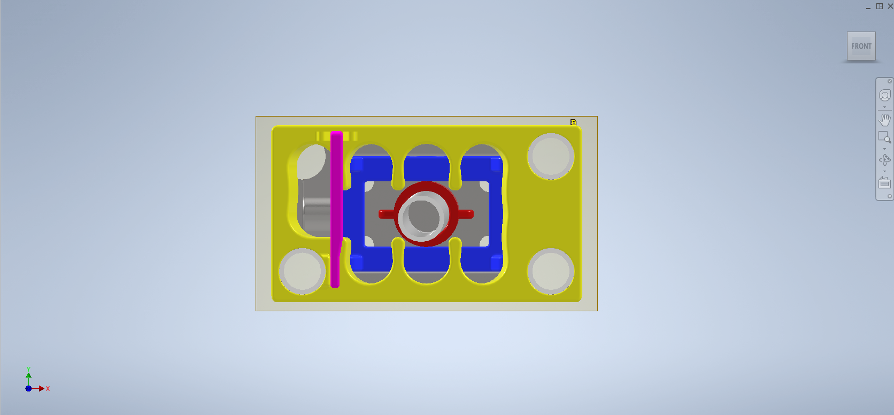

The tabs on the red part and the blue hooks are, again, for rubber bands for auto-centering horizontally (we keep this project low-budget💸). The slots that the shifter go in have a slightly narrow entrance, this allows the shifter to "pop" in place and stay there. \
\
There are holes on the side walls for the wire to run through. Another wire will run along the shift rod, when it moves into position, the wires will contact and complete the ciruit.
#### Shifter movement:

Considering the amount of connections needed for shifter and gear knob alone, I might migrate some of the inputs to a second Arduino. This will also allow for more buttons and switches to be added in the future.
### Shift Knob
The shift knob is divided into 3 sections. The blue part has a switch poking out of it as the high/low range selector. The Orange part has a joystick to allow rotation of the camera. The grey part contains the potentiometer for the joystick.
#### Front view:
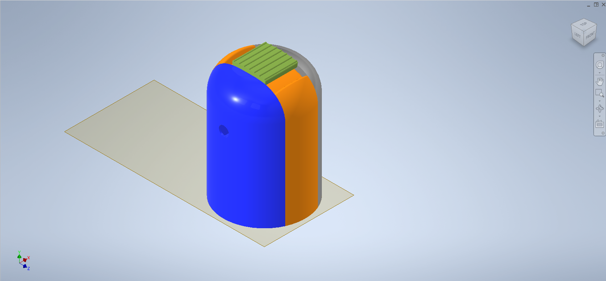

#### Rear view:
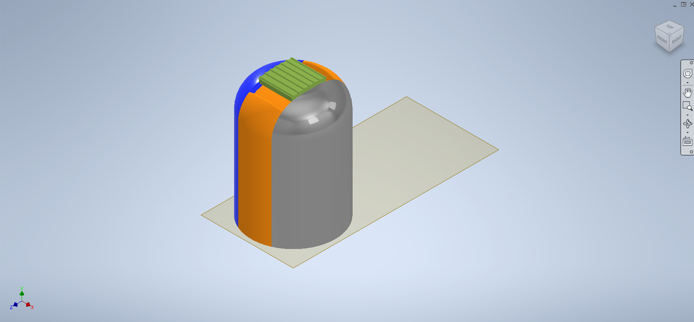

#### Bottom view:
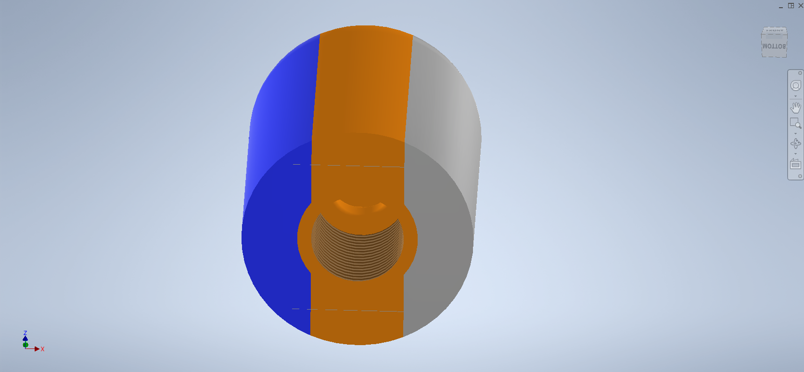

The bottom of the shift knob is a M20 thread with a 12mm hole for the wires to run through.
#### Knob details:

The joystick has a tab at the bottom, which allows rubber band to be attached on either side for auto-centering the camera. Due to the nature of Euro Trucks gameplay, vertical camera movement is not important.